# Secure Notes App

A full-stack secure note-taking application built with **Spring Boot** and **React**. This project demonstrates the implementation of Spring Security concepts including JWT authentication, OAuth2 social login, role-based access control (RBAC), CSRF protection, two-factor authentication (TOTP), audit logging, and password reset via email — all integrated into a working CRUD application.

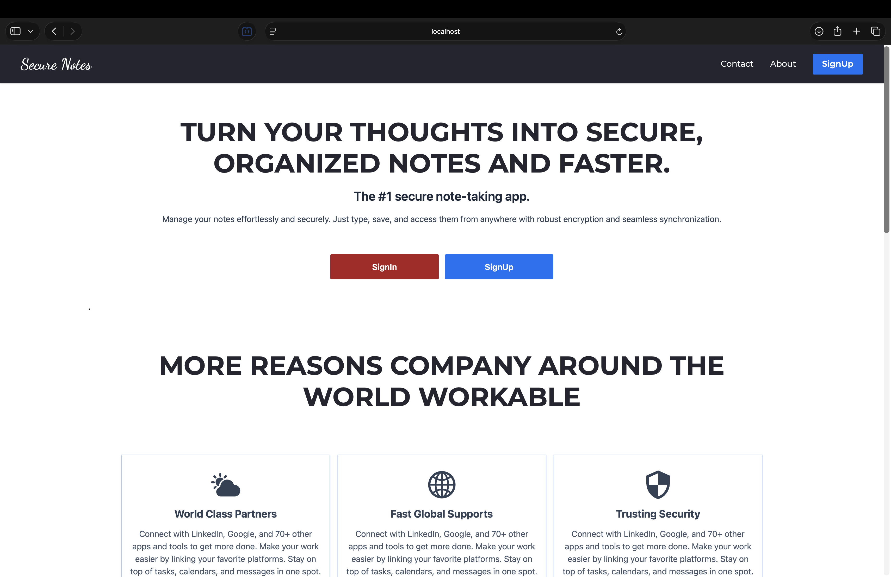

---

## Table of Contents

- [Tech Stack](#tech-stack)
- [Features](#features)
- [Architecture Overview](#architecture-overview)
- [Database Schema](#database-schema)
- [Security Implementation](#security-implementation)
- [API Endpoints](#api-endpoints)
- [Getting Started](#getting-started)
- [Configuration Reference](#configuration-reference)
- [Project Structure](#project-structure)
- [Application Screenshots](#application-screenshots)

---

## Tech Stack

### Backend

| Technology | Version |
|---|---|
| Java | 21 |
| Spring Boot | 3.5.6 |
| Spring Security | (managed by Spring Boot) |
| Spring Data JPA | (managed by Spring Boot) |
| Spring Boot OAuth2 Client | (managed by Spring Boot) |
| Spring Boot Mail | (managed by Spring Boot) |
| Spring Boot Validation | (managed by Spring Boot) |
| JJWT (io.jsonwebtoken) | 0.13.0 |
| Google Authenticator (TOTP) | 1.4.0 |
| MySQL Connector/J | (runtime, managed by Boot) |
| Lombok | (managed by Spring Boot) |
| Maven | Build tool |

### Frontend

| Technology | Version |
|---|---|
| React | 18.3.1 |
| React Router DOM | 6.23.1 |
| Axios | 1.7.0 |
| Material UI | 5.15.19 |
| MUI Data Grid | 7.6.1 |
| Tailwind CSS | 3.4.3 |
| React Quill | 2.0.0 |
| Framer Motion | 11.2.10 |
| DOMPurify | 3.1.4 |

### Database

| Technology | Details |
|---|---|
| MySQL | `securenotes` database on `localhost:3306` |
| Schema Management | `hibernate.ddl-auto=update` (auto-generated) |

---

## Features

### Core
- **Notes CRUD** — Create, read, update, and delete notes scoped to the authenticated user
- **Rich Text Editor** — Notes support rich text content via React Quill
- **XSS Protection** — Note content sanitized with DOMPurify before rendering

### Authentication & Authorization
- **JWT-Based Stateless Authentication** — Bearer token in `Authorization` header; 48-hour expiry
- **OAuth2 Social Login** — GitHub and Google login via Spring Security OAuth2 Client
- **Role-Based Access Control** — `ROLE_USER` and `ROLE_ADMIN` with URL-based and method-level security
- **CSRF Protection** — `CookieCsrfTokenRepository` with token exposed to frontend via `/api/csrf-token`
- **Two-Factor Authentication (2FA)** — TOTP-based using Google Authenticator; QR code generation for setup
- **Password Reset via Email** — UUID-based token with 24-hour expiry, sent via Gmail SMTP

### Admin Panel
- **User Management** — List all users, view details, update roles, lock/unlock accounts, enable/disable accounts, expire/un-expire credentials
- **Audit Logging** — Every note CREATE, UPDATE, and DELETE operation is recorded with username, noteId, content, and timestamp
- **Admin Password Reset** — Admin can reset any user's password

### Other
- **Seed Data** — Default roles (`ROLE_USER`, `ROLE_ADMIN`) and seed users created on application startup via `CommandLineRunner`
- **Account Status Flags** — `accountNonLocked`, `accountNonExpired`, `credentialsNonExpired`, `enabled`

---

## Architecture Overview

```
┌──────────────────┐         ┌──────────────────────────────────────────┐
│                  │  HTTP   │              Spring Boot                 │
│   React Client   │◄───────►│                                          │
│   (Port 3000)    │  REST   │  ┌──────────────────────────────────┐    │
│                  │         │  │     Security Filter Chain        │    │
└──────────────────┘         │  │                                  │    │
                             │  │  CorsFilter                      │    │
                             │  │  └─►CsrfFilter                   │    │
                             │  │       └─►AuthTokenFilter (JWT)   │    │
                             │  │            └─►AuthorizationFilter│    │
                             │  └──────────────────────────────────┘    │
                             │                    │                     │
                             │  ┌─────────────────▼────────────────┐    │
                             │  │         Controllers              │    │
                             │  │  AuthController  NoteController  │    │
                             │  │  AdminController                 │    │
                             │  │  CsrfTokenController             │    │
                             │  │  AuditLogController              │    │
                             │  └─────────────────┬────────────────┘    │
                             │                    │                     │
                             │  ┌─────────────────▼────────────────┐    │
                             │  │           Services               │    │
                             │  │  UserService  NoteService        │    │
                             │  │  AuditLogService  EmailService   │    │
                             │  │  TotpService                     │    │
                             │  └─────────────────┬────────────────┘    │
                             │                    │                     │
                             │  ┌─────────────────▼────────────────┐    │
                             │  │      JPA Repositories            │    │
                             │  │  UserRepository  NoteRepository  │    │
                             │  │  RoleRepository                  │    │
                             │  │  AuditLogRepository              │    │
                             │  │  PasswordResetTokenRepository    │    │
                             │  └─────────────────┬────────────────┘    │
                             │                    │                     │
                             └────────────────────┼─────────────────────┘
                                                  │
                                         ┌────────▼────────┐
                                         │     MySQL DB    │
                                         │  (securenotes)  │
                                         └─────────────────┘
```

---

## Database Schema

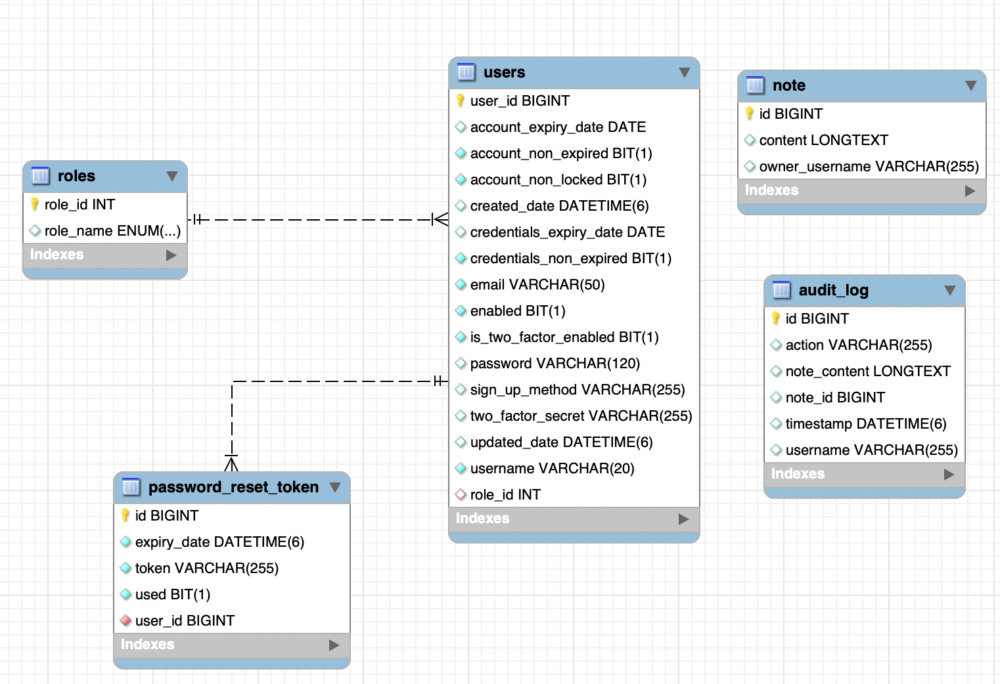

### Entities

**users**

| Column | Type | Constraints |
|---|---|---|
| `user_id` | BIGINT (auto) | Primary Key |
| `username` | VARCHAR(20) | Unique, Not Blank |
| `email` | VARCHAR(50) | Unique, Not Blank, @Email |
| `password` | VARCHAR(120) | @JsonIgnore |
| `account_non_locked` | BOOLEAN | Default: true |
| `account_non_expired` | BOOLEAN | Default: true |
| `credentials_non_expired` | BOOLEAN | Default: true |
| `enabled` | BOOLEAN | Default: true |
| `credentials_expiry_date` | DATE | |
| `account_expiry_date` | DATE | |
| `two_factor_secret` | VARCHAR | |
| `is_two_factor_enabled` | BOOLEAN | Default: false |
| `sign_up_method` | VARCHAR | "email" / "github" / "google" |
| `role_id` | INT | FK → roles.role_id |
| `created_date` | DATETIME | @CreationTimestamp |
| `updated_date` | DATETIME | @UpdateTimestamp |

**roles**

| Column | Type | Constraints |
|---|---|---|
| `role_id` | INT (auto) | Primary Key |
| `role_name` | VARCHAR(20) | ROLE_USER / ROLE_ADMIN |

**note**

| Column | Type | Constraints |
|---|---|---|
| `id` | BIGINT (auto) | Primary Key |
| `content` | LONGTEXT (@Lob) | |
| `owner_username` | VARCHAR | |

**audit_log**

| Column | Type | Constraints |
|---|---|---|
| `id` | BIGINT (auto) | Primary Key |
| `action` | VARCHAR | CREATE / UPDATE / DELETE |
| `username` | VARCHAR | |
| `note_id` | BIGINT | |
| `note_content` | LONGTEXT (@Lob) | |
| `timestamp` | DATETIME | |

**password_reset_token**

| Column | Type | Constraints |
|---|---|---|
| `id` | BIGINT (auto) | Primary Key |
| `token` | VARCHAR | Unique, Not Null |
| `expiry_date` | INSTANT | Not Null |
| `used` | BOOLEAN | Not Null |
| `user_id` | BIGINT | FK → users.user_id |

### Relationships
- `Role` (1) ↔ (N) `User` — One role can have many users; each user has one role (`@ManyToOne`, eager fetch)
- `User` (1) ↔ (N) `PasswordResetToken` — One user can have many reset tokens (`@ManyToOne`, lazy fetch)

---

## Security Implementation

### JWT Authentication Flow

1. Client sends `POST /api/auth/public/signin` with credentials
2. `AuthenticationManager` authenticates via `UserDetailsServiceImpl` + `BCryptPasswordEncoder`
3. On success, `JwtUtils` generates a signed JWT containing: `username`, `roles`, `is2faEnabled`
4. Token is signed using **HMAC-SHA** with a Base64-decoded secret key
5. Client stores JWT in `localStorage` and attaches it as `Authorization: Bearer <token>` on every request
6. `AuthTokenFilter` (extends `OncePerRequestFilter`) intercepts requests, validates the JWT, loads `UserDetails`, and sets the `SecurityContextHolder`

### OAuth2 Social Login Flow

1. Frontend redirects to `/oauth2/authorization/github` or `/oauth2/authorization/google`
2. Spring Security handles the OAuth2 dance (redirect → consent → callback)
3. `OAuth2LoginSuccessHandler` extracts user email from OAuth2 attributes
4. If user doesn't exist → auto-registers with `ROLE_USER` and `signUpMethod` set to `"github"` / `"google"`
5. Generates JWT from the authenticated principal
6. Redirects to `http://localhost:3000/oauth2/redirect?token=<jwt>`
7. Frontend `OAuth2RedirectHandler` extracts token from URL params and stores it in `localStorage`

### CSRF Protection

- Enabled via `CookieCsrfTokenRepository.withHttpOnlyFalse()` — frontend reads the `XSRF-TOKEN` cookie
- Public authentication routes (`/api/auth/public/**`) are excluded from CSRF enforcement
- Frontend fetches token from `GET /api/csrf-token` and sends it as `X-XSRF-TOKEN` header via Axios interceptor

### RBAC (Role-Based Access Control)

- **URL-based security** — `SecurityFilterChain` restricts `/api/admin/**` to `ROLE_ADMIN`
- **Method-level security** — `@PreAuthorize("hasRole('ROLE_ADMIN')")` on audit log endpoints
- `@EnableMethodSecurity(prePostEnabled = true, securedEnabled = true, jsr250Enabled = true)` is enabled

### Two-Factor Authentication (TOTP)

- Uses `com.warrenstrange:googleauth` library for Time-Based One-Time Password (TOTP)
- `POST /api/auth/enable-2fa` generates a secret and returns a QR code URL for Google Authenticator
- `POST /api/auth/verify-2fa` verifies the TOTP code and enables 2FA on the user account
- During login, if 2FA is enabled, the client must call `POST /api/auth/public/verify-2fa-login` with the TOTP code

### Password Reset

- `POST /api/auth/public/forgot-password` generates a UUID reset token with 24-hour expiry
- Email is sent via Gmail SMTP using `Spring Boot Mail`
- `POST /api/auth/public/reset-password` validates the token, checks expiry, and updates the password (BCrypt encoded)
- Tokens are single-use (marked `used = true` after consumption)

### Password Encoding

- All passwords are encoded with `BCryptPasswordEncoder` (configured as a `@Bean`)

---

## API Endpoints

### Authentication — `/api/auth`

| Method | Endpoint | Access | Description |
|---|---|---|---|
| POST | `/public/signin` | Public | Login with username/password, returns JWT |
| POST | `/public/signup` | Public | Register new user account |
| GET | `/user` | Authenticated | Get current user details |
| GET | `/username` | Authenticated | Get current username |
| POST | `/public/forgot-password` | Public | Send password reset email |
| POST | `/public/reset-password` | Public | Reset password using token |
| POST | `/enable-2fa` | Authenticated | Generate 2FA secret, return QR URL |
| POST | `/disable-2fa` | Authenticated | Disable 2FA |
| POST | `/verify-2fa` | Authenticated | Verify TOTP code and enable 2FA |
| GET | `/user/2fa-status` | Authenticated | Check if 2FA is enabled |
| POST | `/public/verify-2fa-login` | Public | Verify 2FA code during login |

### Notes — `/api/notes`

| Method | Endpoint | Access | Description |
|---|---|---|---|
| POST | `/` | Authenticated | Create a new note |
| GET | `/` | Authenticated | Get all notes for the authenticated user |
| PUT | `/{noteId}` | Authenticated | Update a note |
| DELETE | `/{noteId}` | Authenticated | Delete a note |

### Admin — `/api/admin`

| Method | Endpoint | Access | Description |
|---|---|---|---|
| GET | `/getusers` | ROLE_ADMIN | List all users |
| GET | `/user/{id}` | ROLE_ADMIN | Get user details by ID |
| GET | `/roles` | ROLE_ADMIN | List all roles |
| PUT | `/update-role` | ROLE_ADMIN | Update user role |
| PUT | `/update-lock-status` | ROLE_ADMIN | Lock/unlock user account |
| PUT | `/update-expiry-status` | ROLE_ADMIN | Set account expiry status |
| PUT | `/update-enabled-status` | ROLE_ADMIN | Enable/disable user account |
| PUT | `/update-credentials-expiry-status` | ROLE_ADMIN | Set credentials expiry status |
| PUT | `/update-password` | ROLE_ADMIN | Admin password reset for a user |

### Audit Logs — `/api/audit`

| Method | Endpoint | Access | Description |
|---|---|---|---|
| GET | `/` | ROLE_ADMIN | Get all audit logs |
| GET | `/note/{id}` | ROLE_ADMIN | Get audit logs for a specific note |

### CSRF

| Method | Endpoint | Access | Description |
|---|---|---|---|
| GET | `/api/csrf-token` | Public | Get CSRF token |

---

## Getting Started

### Prerequisites

- **Java 21** (JDK)
- **Maven** (or use the included `mvnw` wrapper)
- **MySQL** (running on `localhost:3306`)
- **Node.js** and **npm** (for the React frontend)

### 1. Clone the Repository

```bash
git clone git@github.com:HridayBuilds/Secure-Notes-App.git
cd Secure-Notes-App
```

### 2. Set Up MySQL Database

Create the database — Hibernate will auto-generate the tables on startup:

```sql
CREATE DATABASE securenotes;
```

### 3. Configure Backend

Open `Backend/src/main/resources/application.properties` and replace the placeholder values with your actual credentials:

```properties
# MySQL
spring.datasource.password=YOUR_MYSQL_PASSWORD

# JWT (use a long random Base64 string)
spring.app.jwtSecret=YOUR_JWT_SECRET_KEY

# Gmail SMTP (use an App Password, not your account password)
spring.mail.username=YOUR_EMAIL@gmail.com
spring.mail.password=YOUR_GMAIL_APP_PASSWORD

# GitHub OAuth2 (register at https://github.com/settings/developers)
spring.security.oauth2.client.registration.github.client-id=YOUR_GITHUB_CLIENT_ID
spring.security.oauth2.client.registration.github.client-secret=YOUR_GITHUB_CLIENT_SECRET

# Google OAuth2 (register at https://console.cloud.google.com/apis/credentials)
spring.security.oauth2.client.registration.google.client-id=YOUR_GOOGLE_CLIENT_ID
spring.security.oauth2.client.registration.google.client-secret=YOUR_GOOGLE_CLIENT_SECRET
```

> **Note:** All configuration is done directly in `application.properties`. No `.env` file is needed for the backend.

### 4. Run the Backend

```bash
cd Backend
./mvnw spring-boot:run
```

The backend starts on `http://localhost:8080`.

### 5. Run the Frontend

```bash
cd Frontend
npm install
npm start
```

The frontend starts on `http://localhost:3000`.

### 6. Default Seed Users

On first startup, the application creates default users:

| Username | Password | Role |
|---|---|---|
| `user1` | `password1` | ROLE_USER |
| `admin` | `adminPass` | ROLE_ADMIN |

---

## Configuration Reference

All backend configuration is in `Backend/src/main/resources/application.properties`:

| Property | Description |
|---|---|
| `spring.datasource.url` | MySQL JDBC connection URL |
| `spring.datasource.username` | MySQL username |
| `spring.datasource.password` | MySQL password |
| `spring.app.jwtSecret` | Secret key for signing JWT tokens (Base64 encoded) |
| `spring.app.jwtExpirationMs` | JWT token expiry in milliseconds (default: 172800000 = 48 hours) |
| `spring.mail.username` | Gmail address for sending password reset emails |
| `spring.mail.password` | Gmail App Password ([how to generate](https://support.google.com/accounts/answer/185833)) |
| `spring.security.oauth2.client.registration.github.*` | GitHub OAuth2 client credentials |
| `spring.security.oauth2.client.registration.google.*` | Google OAuth2 client credentials |
| `frontend.url` | Frontend URL for CORS and OAuth2 redirect (default: `http://localhost:3000`) |

---

## Project Structure

```
Secure-Notes-App/
├── Backend/
│   ├── pom.xml
│   └── src/main/java/com/secure/notes/
│       ├── NotesApplication.java                 # Entry point + CommandLineRunner (seed data)
│       ├── config/
│       │   └── OAuth2LoginSuccessHandler.java    # OAuth2 success → JWT generation + redirect
│       ├── controllers/
│       │   ├── AuthController.java               # Auth, 2FA, password reset endpoints
│       │   ├── NoteController.java               # Notes CRUD endpoints
│       │   ├── AdminController.java              # Admin user management endpoints
│       │   ├── AuditLogController.java           # Audit log viewing endpoints
│       │   └── CsrfTokenController.java          # CSRF token endpoint
│       ├── models/
│       │   ├── User.java                         # User entity (JPA + validation)
│       │   ├── Role.java                         # Role entity (ROLE_USER, ROLE_ADMIN)
│       │   ├── Note.java                         # Note entity
│       │   ├── AuditLog.java                     # Audit log entity
│       │   └── PasswordResetToken.java           # Password reset token entity
│       ├── repositories/                         # Spring Data JPA repositories
│       ├── security/
│       │   ├── SecurityConfig.java               # SecurityFilterChain, CORS, CSRF, RBAC config
│       │   ├── jwt/
│       │   │   ├── AuthTokenFilter.java          # JWT parsing + authentication filter
│       │   │   ├── AuthEntryPointJwt.java        # Unauthorized request handler
│       │   │   └── JwtUtils.java                 # JWT generation + validation utility
│       │   ├── request/                          # Login/Signup request DTOs
│       │   ├── response/                         # Auth response DTOs
│       │   └── services/
│       │       └── UserDetailsServiceImpl.java   # UserDetailsService implementation
│       ├── services/
│       │   ├── UserService.java                  # User business logic interface
│       │   ├── NoteService.java                  # Note business logic interface
│       │   ├── AuditLogService.java              # Audit log interface
│       │   ├── EmailService.java                 # Email service interface
│       │   ├── TotpService.java                  # TOTP 2FA interface
│       │   └── impl/                             # Service implementations
│       ├── dtos/                                 # Data Transfer Objects
│       └── util/                                 # Utility classes
├── Frontend/
│   ├── package.json
│   └── src/
│       ├── App.js                                # React Router setup
│       ├── components/
│       │   ├── Auth/                             # Login, Signup, OAuth2, ForgotPassword, 2FA
│       │   ├── Notes/                            # AllNotes, CreateNote, NoteDetails
│       │   ├── AuditLogs/                        # Admin panel, user management, audit logs
│       │   └── ...                               # Navbar, Footer, Landing page components
│       ├── services/
│       │   └── api.js                            # Axios instance with JWT + CSRF interceptors
│       └── store/
│           └── ContextApi.js                     # React Context for global state
├── Images/                                       # Application screenshots
├── db-schema.png                                 # Database schema diagram
└── README.md
```

---

## Application Screenshots

### Authentication

| Login | Sign Up |
|:---:|:---:|
| 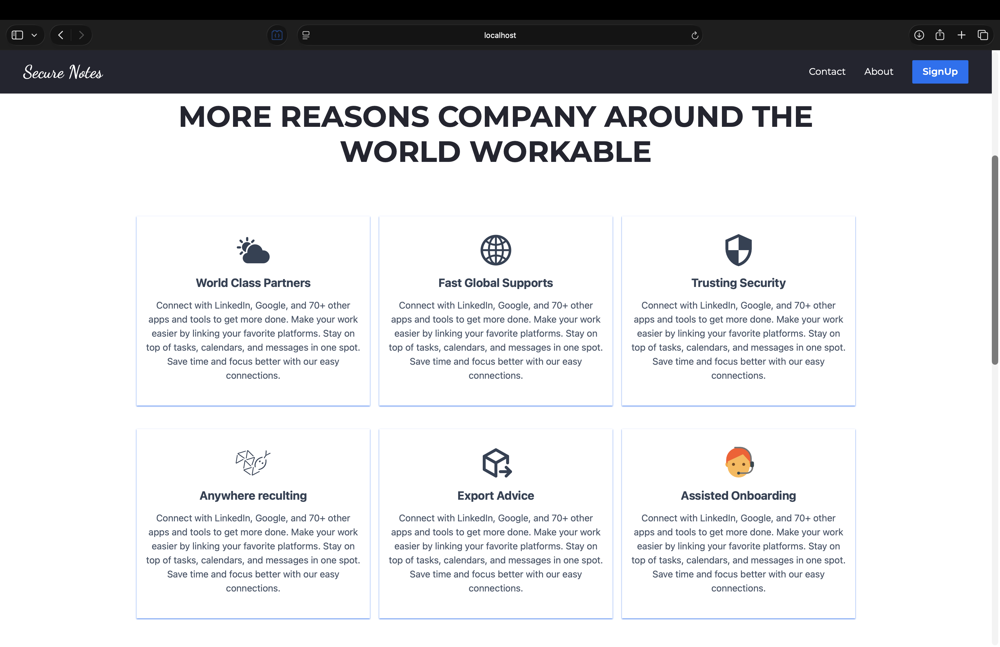 | 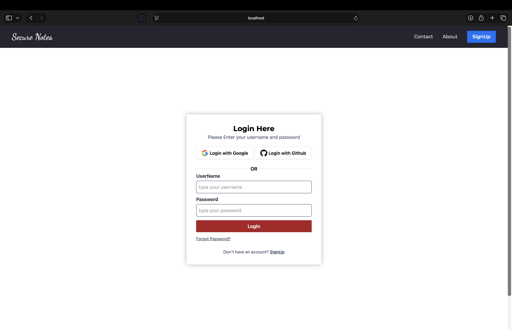 |

### Notes Management

| Notes List | Create Note |
|:---:|:---:|
| 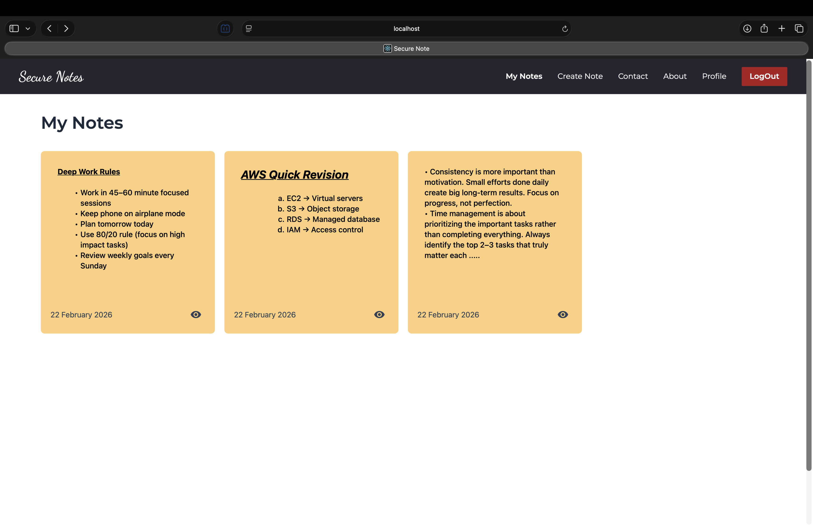 | 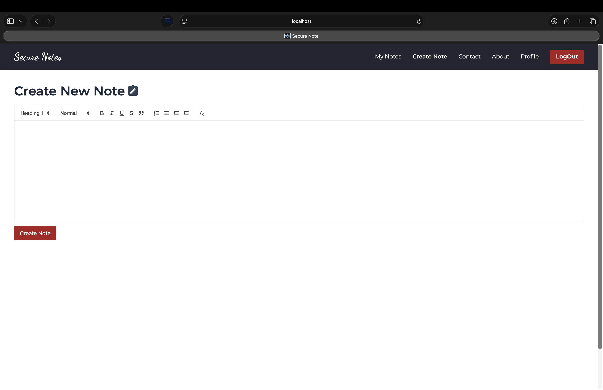 |

### Admin Panel

| User Management | Audit Logs |
|:---:|:---:|
| 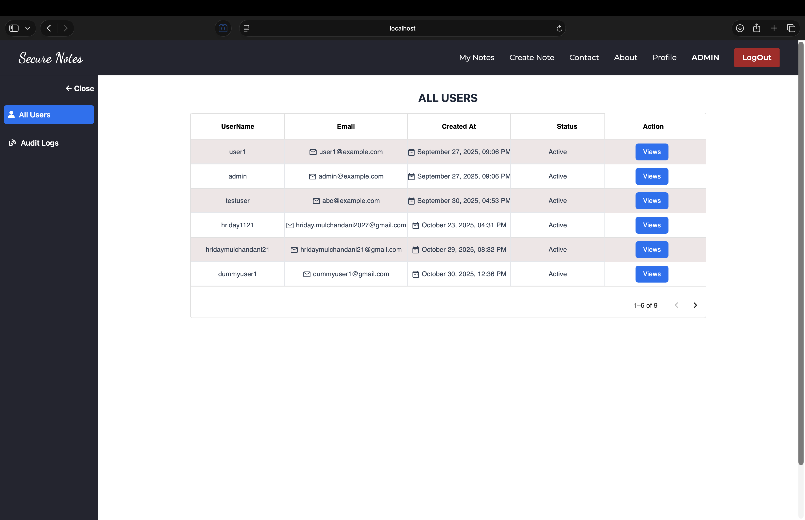 | 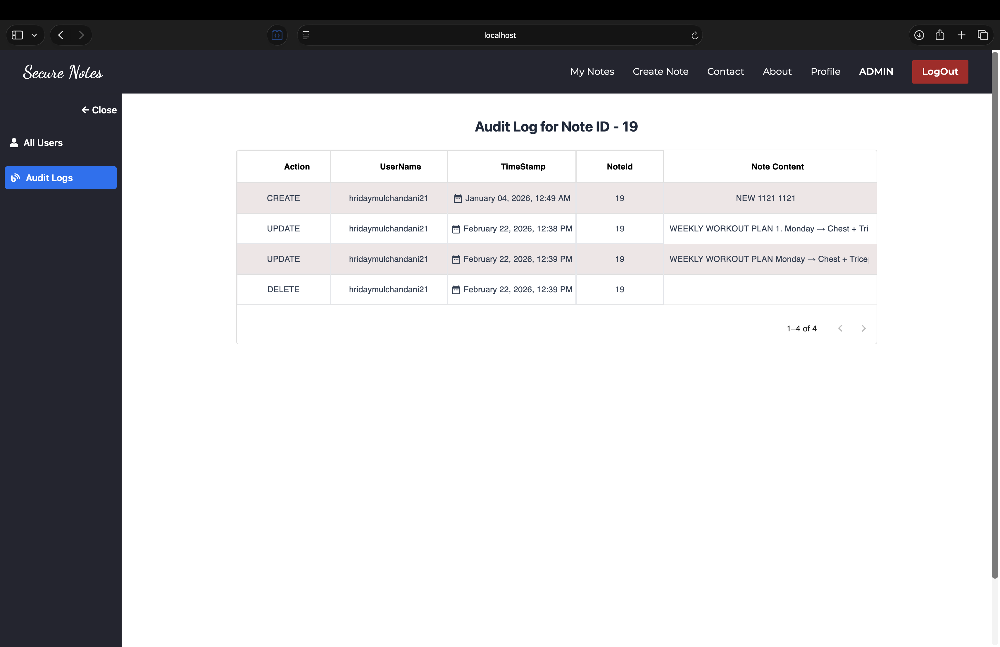 |

---

### More Screenshots

<details>
<summary>Click to expand</summary>
<br>

| | |
|:---:|:---:|
| 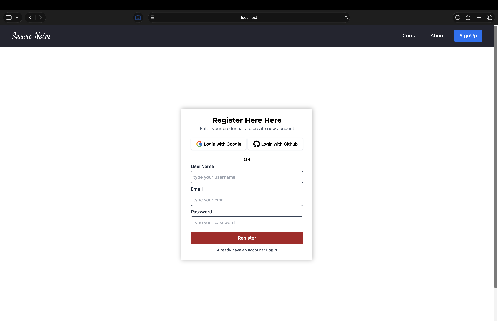 | 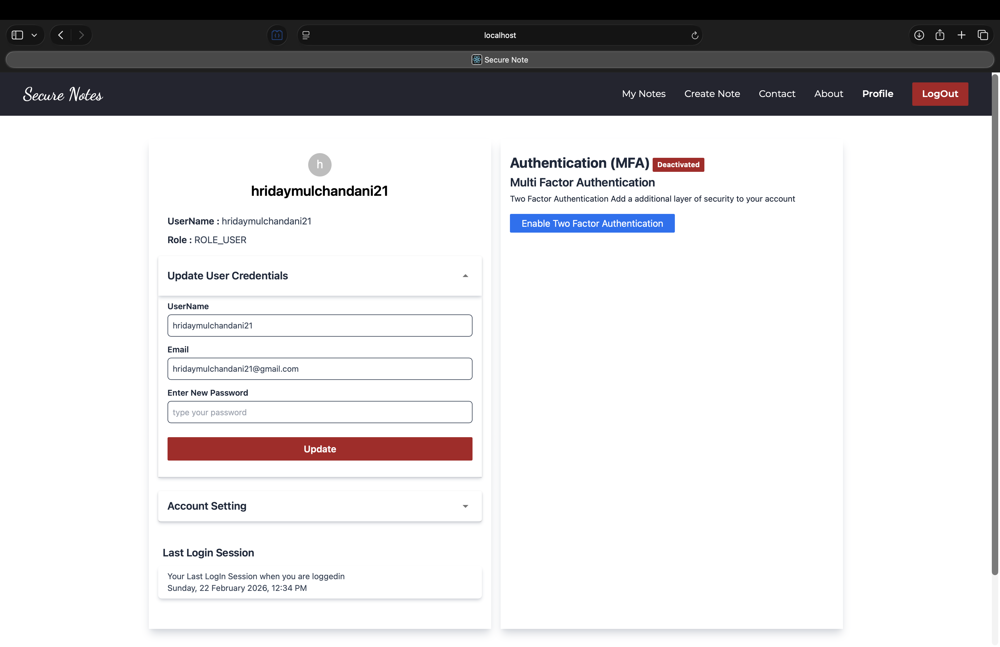 |
| 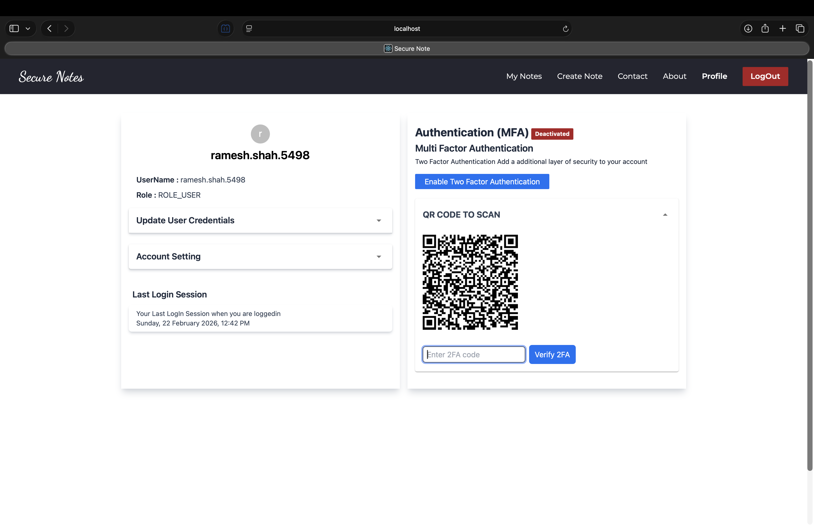 | 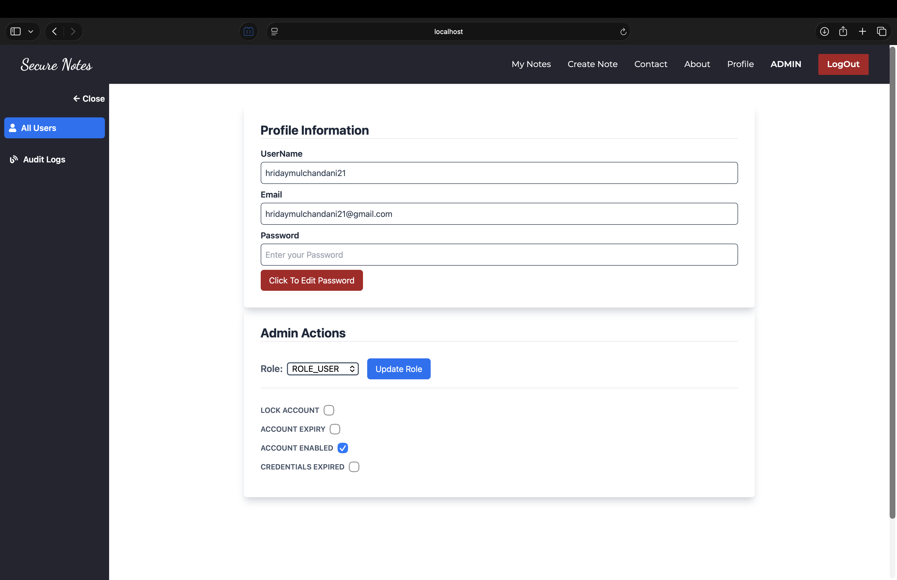 |

</details>

---

